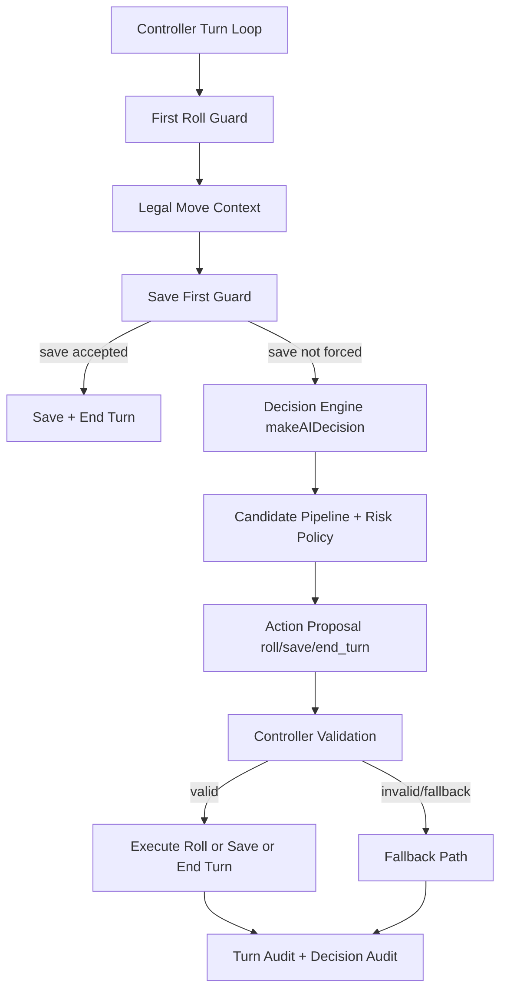

AI_STRATEGY

Projekt: Hero Dice
Verze projektu: 3.7
Typ dokumentu: Technicka strategie AI
Status: Active
Datum: 2026-07-03

---

## 1. Purpose

Role AI hrace:
- AI zastupuje computer hrace v Play Mode a provadi kompletni tah od prvniho hodu po terminalni akci (`save` nebo `end_turn`).
- AI musi zachovat legalitu tahu, respektovat write pravidla kategorii a neblokovat hru deadlockem.

Filozofie navrhu:
- Minimalni risk regresi: Controller vrstva chrani tok tahu guardy a finalni validaci.
- Strategicke rozhodovani je oddeleno do Decision Engine (`makeAIDecision`).
- Diagnostika je audit-first: rozhodnuti se maji overovat pres audit data, ne pocitove pozorovani.

Cile AI:
- maximalizovat dlouhodoby score potencial,
- preferovat zapisovatelne a legalni cile,
- adaptovat risk podle stavu zapasu a remaining rolls,
- drzet hru plynulou (bez stall/dead end smycek),
- zachovat stabilni kontrakt Controller <-> Decision Engine.

---

## 2. AI Philosophy

Charakter AI:
- ambitious: early faze, vice rollu, preference high-value seedu (6/5/4), vyssi tolerance rerollu.
- balanced: stredni faze, kombinace score potencialu a legalni flexibility.
- pragmatic: endgame nebo malo rollu, preference dokoncenych a bezpecnych save vetvi.

Priority:
- vysoke skore a near-max potencial,
- dlouhodoba strategie pres otevrene legalni cesty,
- respekt writable category setu,
- adaptivni risk podle score delta, endgame stavu a remaining rolls.

---

## 3. High-Level Architecture

Vrstvy:
- Controller: `app/page.tsx`
- Decision Engine: `app/lib/aiPlayer.ts`
- Audit Layer: turn audit v controlleru + decision audit v engine
- Legal Validation: `app/lib/combinationValidation.ts`

Tok odpovednosti:

---

## 4. Complete Decision Pipeline

1. First Roll Guard
- Pred prvnim hodem AI neplanuje slozite locky.
- Nejdriv zajisti prvni hod a cisty lock state.

2. Legal Move Context
- Controller pripravi legal context (writable save, dostupne cile, lock compatibility, fixed locks).

3. Save First Guard
- Controller muze vynutit save drive, nez vola engine (strong save / timing save).

4. Candidate Generation
- Engine generuje kandidaty kombinaci podle sablon a aktualnich kostek.
- Mimo zakladni kandidaty muze pridat explicit high-value builder kandidaty.

5. Candidate Filtering
- Bezpecne locky, fixed-lock kompatibilita, low-base/near-max/minimum score filtry.
- Rejekce kandidatu bez strategickeho smeru.

6. Strategy Score
- Pro kazdeho kandidata se pocita strategicke score s detailnim breakdown.

7. Candidate Ranking
- Kandidati se seradi policy comparator logikou.
- Tie-breaky: strategicka sila, lock count, expected value, lock value sum.

8. Risk Policy
- Profil ambitious/balanced/pragmatic.
- Risk level low/medium/high pro vysledny payload.

9. Final Action
- KompletnI kandidat typicky vede na `save`.
- Nekompletni kandidat typicky vede na `roll` (pokud jsou hody).

10. Controller Validation
- Controller overi legalitu navrzenych locku/targetu pred exekuci.
- Pri poruseni kontraktu prepne na fallback.

11. Roll / Save / End Turn
- Exekuce terminalni akce a navazujici reset/sync kroku tahu.

---

## 5. Decision Contracts

### makeAIDecision()

Funkce:
- `makeAIDecision(currentDice, currentCombination, scores, playerId, playModeAllowRewrite, remainingRolls, strategyContext)`

Vstupy:
- `currentDice`: 6 hodnot kostek,
- `currentCombination`: aktualne detekovana kombinace,
- `scores`: score map vsech hracu,
- `playerId`: aktivni AI hrac,
- `playModeAllowRewrite`: zda je povolen rewrite,
- `remainingRolls`: zbyvajici hody v tahu,
- `strategyContext`: fixed locks, previous target, legalMoveContext.

Vystupy (`AIDecision`):
- akce: `action` (`roll` | `save` | `end_turn`),
- cil: `targetCategory`,
- lock payload: `lockMask`, `lockedDiceIndices`,
- confidence: `confidence` (0..1),
- riskLevel: `low` | `medium` | `high`,
- pivot metadata: `currentPlanValue`, `alternativePlanValue`, `pivotThreshold`, `pivotReason`,
- match context metadata: score delta, required score estimate, endgame, remaining categories,
- diagnosticky duvod: `reason` + optional `fallbackReason`.

Garance:
- Pri invalidnich nebo chybejicich vstupech vraci bezpecny fallback decision.
- Engine vraci deterministicky payload pro aktualni snapshot stavu.

### legalMoveContext

Obsah (`AILegalMoveContext`):
- `currentCombination`,
- `writableSaveCandidate`,
- `availableTargetCategories`,
- `lockCompatibility`,
- `rewriteAllowed`,
- `fixedLocks`,
- `remainingRolls`.

Vyznam:
- Je to legalni gate mezi Controllerem a Engine.
- Definuje, ktere cile jsou realne zapisovatelne a kompatibilni se stavem locku.

Garance:
- Decision Engine musi respektovat legalMoveContext jako source of truth legality.
- Controller pred exekuci provadi finalni overeni navrhu.

---

## 6. Strategy Engine

Candidate Generation:
- template-based evaluace kombinaci,
- odvozene relevant indices a progress.

Builder Patterns:
- explicit high-value patterny: [6], [5], [4], [6,5], [6,4], [5,4], [6,5,4].

Near Max Policy:
- mimo vyjimky AI filtruje kandidaty, ktere nedosahuji near-max potencialu.
- tolerance je nastavena jako max minus 3 body.

Minimum Score:
- dynamicky minimum acceptable score podle remaining rolls, endgame a score kontextu.

Open Paths:
- score otevrenych strategickych moznosti (`openOptionsScore`).
- bonus za vice legalnich target cest.

Dead End Penalty:
- penalizace locku, ktere zabiji vsechny legalni cesty.

Pivot Logic:
- AI muze prepnout plan, pokud alternativa dostatecne prekonava aktualni smer.
- threshold je dynamicky dle game contextu.

Remaining Rolls Policy:
- ovlivnuje risk profil, minimum score, roll pressure i open strategy bonus.

Category Priority:
- kombinace maji explicitni prioritu a max score mapu.
- score/ranking respektuje writable/rewrite stav kategorie.

---

## 7. Save Strategy

Strong Save Guard:
- maximalni score kategorie,
- kompletni Postupka 21,
- vyrazne silny absolutni score,
- rewrite, ktery realne zlepsuje existujici zapis.

Timing Guard:
- save pri nizkych remaining rolls,
- save kdyz legalne neni lepsi improve vetve,
- save pri no-rolls-left.

Immediate Save:
- save-first guard ma prioritu pred decision engine.

Fallback:
- pokud save neni legalni/writable v okamziku exekuce,
- Controller prejde na safe fallback (`roll` nebo `end_turn` podle stavu).

---

## 8. Locking System

Typy locku:
- Working Locks: planovane locky pro aktualni krok.
- Fixed Locks: potvrzene locky, ktere nelze porusit navrhem.
- Confirmed Locks: lock state potvrzeny po predchozi exekuci.

Merge:
- finalni lock maska se sklada pres merge working + fixed.

Validation:
- controller sanitizace lock mask shape,
- legalita targetu proti fixed locks (`canTargetCategoryWorkWithFixedLocks`),
- ochrana proti nelegalnimu unlocku fixed locku.

Fallback:
- pri lock konfliktu nebo nelegalnim targetu se locky vycisti na bezpecny stav,
- AI dostane novy reroll/replan window.

---

## 9. Controller Responsibilities

Controller (`app/page.tsx`) ridi:
- sequencing AI tahu,
- timeout a anti-stall guardy,
- first roll guard,
- save guardy,
- legalitu pred exekuci,
- save orchestrace a end turn handoff,
- fallback vetve pri nekompatibilnim rozhodnuti engine.

Controller je finalni vykonavaci autorita. Decision Engine navrhuje, Controller validuje a provadi.

---

## 10. Audit System

Turn Audit:
- Controller zapisuje turn-level udalosti a guard rozhodnuti.
- Lokalni temporary storage: `heroDiceTempAiTurnAudit`.

Decision Audit:
- Engine zapisuje candidate-level pipeline, ranking, winner reasons a fallback metadata.
- Lokalni temporary storage: `heroDiceTempAiDecisionAudit`.

TTL a kapacita (Decision Audit):
- max entries: 60,
- ttl: 6 hodin.

Storage:
- localStorage, pouze dev diagnostika.

Debug workflow:
- analyza problemu vzdy audit-first,
- reprodukce bugu pres strukturovane eventy,
- potvrzeni fixu porovnanim pred/po audit stop.

---

## 11. Stable Invariants

Bez silneho duvodu nemenit:
- kontrakt Controller <-> Decision Engine,
- save-first guard prioritu,
- legal validation gate (writable categories + fixed-lock kompatibilita),
- lock contract (fixed locks nesmi byt navrhem poruseny),
- audit vrstvu a format diagnostickych dat.

Tyto body tvori stabilizacni jadro AI v3.7.

---

## 12. AI Development Workflow

Doporuceny postup:
- 1 bug
- 1 hypoteza
- 1 zmena
- audit
- test
- hotovo

Pravidlo:
- neprovadet hromadne AI refaktory behem stabilizacni faze,
- kazda zmena musi byt auditovatelna a regresne overitelna.

---

## 13. Future Development Rules

Zakazane zasahy bez explicitniho tasku:
- zmeny architecture boundaries mezi Controller a Engine,
- zruseni legal validation gate,
- vypnuti save guard vrstev,
- zmena lock contractu bez kompletniho audit planu,
- rozsahle behavior refaktory bez fazovani.

Doporucene zmeny:
- male, izolovane heuristicke upravy,
- lokalni fixy jednoho bug typu,
- doplneni audit signalu pred komplexnejsi zmenou.

Regresni testy:
- overeni no deadlock/no stall,
- save legalita a rewrite pravidla,
- lock legalita proti fixed locks,
- stabilita final action policy.

Development rezim:
- audit logy aktivni pouze v development prostredi,
- produkcni runtime nesmi byt audit telemetrii ovlivnen.

---

## 14. Related Files

- `app/lib/aiPlayer.ts`
- `app/page.tsx`
- `app/lib/combinationValidation.ts`
- `app/lib/playMode.ts`

Doporucene navazne reference:
- `docs/PROJECT_CONTEXT.md` (AI stabilization sekce)
- `docs/AI_GUIDE.md`
